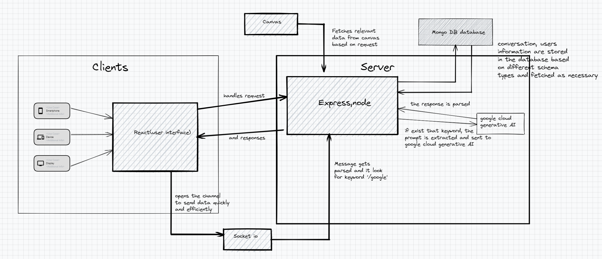

### [devpost link](https://devpost.com/software/chandra-dk1ulx?ref_content=my-projects-tab&ref_feature=my_projects)

## To get Started (must require node > 18.0.0 && npm > 8.1.0)
 - cd backend
 - npm install
 - cd frontend
 - npm install

## Inspiration
The inspiration for developing Chandra stemmed from the observation that myself and several colleagues extensively relied on Discord as a means of supporting various course channels within a server. While Discord proved to be a valuable and practical application, its design did not cater specifically to educational purposes. Consequently, the need arose for constant maintenance to ensure that it effectively facilitated the engagement of all students and provided them with designated channels for inquiries and collaborative discussions. While this approach sufficed, it necessitated considerable manual effort to sustain the server's functionality and uninterrupted operation. This responsibility began to resemble an administrative task, diverting attention from the primary focus of the students— their courses. Furthermore, we recognized that the utilization of generative AI technology within the learning process held significant potential; however, the cumbersome process of toggling between a website and a chat application proved to be inefficient. Sharing screenshots as responses further compounded these inefficiencies.
To address these challenges comprehensively, I embarked on the development of Chandra, a platform aimed at benefiting both students and educators alike. Its purpose is to streamline and optimize the learning experience by effectively addressing the aforementioned issues. By leveraging Chandra, students and educators can concentrate on their coursework while benefiting from an integrated solution that seamlessly combines the functionalities of an educational platform with the collaborative and generative AI capabilities necessary for efficient communication and content sharing.
## What it does
Chandra is a messaging application built on the Canvas platform, offering students a seamless connection to their Canvas contacts. It automates the creation of group chats based on the courses in which individuals are enrolled. For instance, if a student is enrolled in a computer architecture class, Chandra facilitates the establishment of a group chat encompassing all participants of that particular class. This eliminates the need for manual maintenance of such group conversations, ensuring a hassle-free experience for students.
Moreover, Chandra incorporates a powerful generative AI feature from Google Cloud. This feature enables all members of the group chat to interact with generative AI technology directly within the application. Consequently, there is no longer a requirement to navigate back and forth between external websites or share generated content separately with other students. This integration fosters a streamlined and focused conversation channel, allowing users to connect more effectively and enhance their productivity and learning efficiency.
Chandra extends its functionality beyond group chats by providing users with a one-on-one conversation channel. This facilitates direct interaction between individuals without the need to broadcast messages to an entire group. Similar to the group chat feature, Chandra incorporates generative AI capabilities within individual conversations, empowering users to engage in more productive discussions and facilitate more efficient learning.
## How we built it
The application was developed utilizing the MERN stack.To enhance the messaging capabilities and ensure optimal responsiveness, we integrated Socket.io for real-time communication.
Furthermore, the integration of Canvas LMS API and Google Cloud Generative AI API played a pivotal role in enhancing the user experience and embedding advanced features within the chat application. Leveraging the Canvas LMS API allowed seamless integration with the Canvas Learning Management System, ensuring a user-friendly interface and facilitating streamlined access to course information. The incorporation of the Google Cloud Generative AI API empowered users to benefit from the cutting-edge capabilities of generative AI, enabling more interactive and dynamic conversations.
The server was built using the Express.js framework, providing a robust and scalable foundation for the application. All user data and message conversations are securely stored and managed in a MongoDB database, ensuring data integrity and efficient retrieval.
## Challenges we ran into
Throughout the development process, we encountered several significant challenges. Initially, our plan was to utilize the OAuth2 feature from the Canvas LMS API to authenticate users within the Chandra application. However, we soon realized that implementing this feature required obtaining explicit permission from our school, which proved to be a time-consuming process. Given our limited timeframe, we made the strategic decision to pivot our development approach. Instead, we opted to have users self-generate a token from Canvas, which Chandra could then leverage to fetch their information effectively.
Additionally, we encountered complications related to Cross-Origin Resource Sharing (CORS) when accessing the APIs from our React front-end. To overcome this obstacle, we implemented a separate route within our backend. By fetching the required data on the server-side and providing the appropriate responses to the front-end, we successfully circumvented CORS-related issues.
These challenges demanded flexibility, adaptability, and creative problem-solving. By making adjustments to our original plans and exploring alternative solutions, we were able to overcome these hurdles and progress towards the successful development of the Chandra application.
## Accomplishments that we're proud of
I take pride in accomplishing the development of the entire front-end and back-end components of the application, along with implementing the necessary logic. Despite the limited timeframe, I successfully achieved my intended goals efficiently. While I did encounter some obstacles during the development process, I was able to overcome them swiftly without significant reliance on external assistance. This self-sufficiency and problem-solving capability allowed me to maintain momentum and deliver the desired outcomes within the allocated time frame.
## What we learned
This project provided valuable learning experiences, expanding my knowledge in several areas. Notably, I gained a deep understanding of working with technologies such as Socket.io, the Express framework, the Canvas Learning Management System, and the Google Cloud Generative AI API.
Working with Socket.io enabled me to grasp the intricacies of real-time communication and enhance my proficiency in building responsive and interactive applications. The utilization of the Express framework further solidified my understanding of developing scalable and efficient server-side components.
Incorporating the Canvas API allowed me to delve into the realm of educational platforms, understanding how to integrate external systems into the application ecosystem and seamlessly leverage course-related information.
Additionally, exploring the capabilities of the Google Cloud Generative AI API broadened my knowledge of AI-driven technologies and their potential applications in enhancing user experiences within the application.
## What's next for Chandra
Chandra has immense potential for further development and expansion. While we have already incorporated some functionalities from the Canvas API, there are numerous untapped features that can be leveraged to enhance the application's functionality and usefulness. Exploring these untapped capabilities and integrating them into Chandra can unlock new possibilities for improving the user experience and facilitating seamless integration with the Canvas platform.
Moreover, the utilization of generative AI opens up limitless opportunities for extending the application's use cases. By capitalizing on the power of generative AI, we can introduce additional features and functionalities that enhance learning, collaboration, and productivity within Chandra. This can include personalized recommendations, intelligent content generation, and adaptive learning tools, among others.

## License
This project is licensed under the MIT License. For more details, see the [LICENSE](LICENSE.txt) file.

